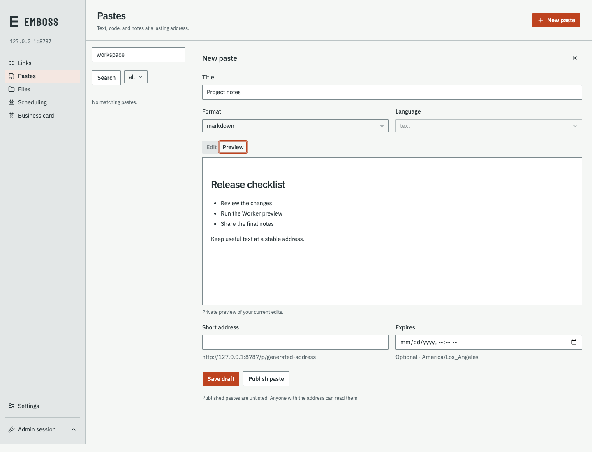

# Emboss

A single-owner home for short links, text/code/Markdown pastes, file shares,
a scheduling redirect, and a public business card. Each tool has a stable address;
QR exports use that address. Administration lives at `/admin`.

Built on Next.js App Router, Cloudflare Workers/OpenNext, D1/Drizzle, and private
R2. The interface uses customized official shadcn/Radix controls and bundled
IBM Plex fonts. No registration, visitor analytics, or external auth service.



## Local development

Use Node 24 and pnpm 12.4.2. No Cloudflare account is needed locally.

```sh
pnpm install --frozen-lockfile
pnpm setup:local
pnpm preview
```

`setup:local` applies migrations, prompts for a password in the terminal, writes
its salted verifier to ignored `.dev.vars`, and generates binding types. Any
nonempty password is allowed, without character-count or complexity rules.
The JSON sign-in request must fit within 8 KiB; setup checks this too.
Open **http://127.0.0.1:8787/admin** after the build.
`pnpm preview:start` starts an already-built Worker. Local D1/R2 state persists in
`.wrangler/state`; do not commit it.

For faster UI iteration, `pnpm dev` serves http://localhost:3000 with the same
emulated bindings. Verify changes with the Worker preview before treating them
as complete. Restart the server after rotating the password.

## Configuration and limits

`wrangler.jsonc` contains local defaults and explicit `DB`, `FILES`, self-service,
login/write-rate-limit, and hourly Cron bindings. The only application secret is
`ADMIN_PASSWORD_HASH`, set by the operator command. There is no default production
password. Configure deployment environments separately; see [operations](docs/operations.md).

| Setting                   | Default                                              |
| ------------------------- | ---------------------------------------------------- |
| File upload               | 25 MiB, streamed; at most two browser transfers      |
| Storage                   | 1 GiB, including reservations and retained deletions |
| Paste                     | 256 KiB of UTF-8                                     |
| Avatar                    | 2 MiB; PNG/JPEG/WebP with bounded dimensions         |
| Session                   | Seven days, absolute expiry                          |
| Deleted content retention | 30 days                                              |
| Canonical origin          | `APP_BASE_URL`; HTTPS outside localhost development  |

Settings may lower the operator's file, paste, and storage ceilings. Publication
is explicit for pastes, files, and the card. Published content is **unlisted,
not access-controlled**: anyone with its URL can open it. Disable, expiry, and
delete revoke future access immediately; downloaded copies cannot be revoked.
Slugs are permanent and never reused. Expiry alone does not delete file bytes.

The root redirects to the configured personal website, otherwise to a published
card, otherwise returns unavailable. Domains and public identity are configurable;
no domain ownership or deployment is assumed.

## Commands and checks

```sh
pnpm check                 # ESLint and strict TypeScript
pnpm test                  # D1/R2/auth/lifecycle tests in workerd
pnpm build:worker          # Complete OpenNext build
pnpm db:generate           # Generate a migration after schema changes
pnpm db:migrate            # Apply migrations to local D1
pnpm admin:password --local
```

Browser tests use an explicit disposable local password fixture. Stop the preview
first if it is running, then:

```sh
pnpm setup:test
pnpm build:worker
pnpm exec playwright install chromium
pnpm test:e2e
```

`setup:test` resets **local** authentication to `Emboss local test password 2026!`
and revokes existing local sessions. It does not reset content. Browser tests
create local sample data, exercise desktop/mobile flows, upload 25 MiB, decode
QR output independently, and run accessibility checks. Never use the test fixture
on a deployed installation.

The current local verification covers the built Worker. A real staging deployment
must still verify TLS cookies, CPU limits, Cloudflare bindings/Cron, recovery,
and a contact-app import. No free-tier cost claim is made.

## Operations and contributions

[Operations](docs/operations.md) covers isolated deployments, migrations, password
recovery, metadata export, and checked full backup/restore. Keep backups and
operator files private. `.agent-context` is intentionally ignored.

Keep changes scoped, add tests for changed security/lifecycle behavior, and run
checks plus the affected browser flows. Review copied shadcn source changes
instead of blindly regenerating customized components.

MIT licensed; see [LICENSE](LICENSE) and [third-party notices](THIRD_PARTY_NOTICES.md).
