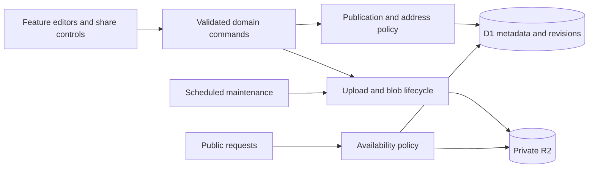

# Emboss product and system design audit

> Historical audit of commit `32c842a`. See the [implemented refinements](IMPLEMENTATION.md) for the subsequent changes and verification.

September 30, 2026 · Evaluated commit `32c842a` · Local built Cloudflare Worker

Emboss has a thoughtful engineering foundation and a recognizable visual identity. Its strongest proposition is a personal home for useful things you share: links, text, files, availability, and your identity. The next product milestone should make that promise obvious in every interaction. Today, routine sharing involves opening editors, understanding inconsistent publication rules, and scrolling past configuration.

The most valuable improvements are **predictable publishing, durable addresses, immediate sharing, and content-first mobile editing**. Visual refinement should build on those changes. The recommended direction is a warm, precise personal instrument: tactile controls, generous reading surfaces, restrained color, and satisfying confirmation when something is ready to send.

This records the evaluation and proposed roadmap before implementation. The subsequent changes are documented in the follow-up linked above. Screenshots contain synthetic local examples and test fixtures.

## Assessment

| Area | Assessment | What would improve it most |
| --- | --- | --- |
| Engineering foundation | Strong for a single-owner application | Explicit domain commands, recovery visibility, staging evidence |
| Product coherence | Useful tools with uneven behavioral conventions | One vocabulary and consistent publish, pause, share, and delete rules |
| Desktop usability | Clear and legible, with unnecessary steps | Direct row actions, better action hierarchy, preserved browsing context |
| Mobile usability | Responsive, but vertically demanding | Dedicated detail views, content-first editors, compact action areas |
| Visual identity | Distinctive and disciplined, emotionally reserved | Warmer surfaces, less uniform framing, purposeful moments of feedback |
| Public experience | Functional but underdeveloped | Better document presentation, descriptive titles, graceful unavailable states |

These are qualitative judgments from inspection, not research scores or measured user satisfaction.

## What deserves to stay

The single-owner scope is valuable. The current Next.js, Worker, D1, and private R2 architecture fits it. A modular application is sufficient; adding distributed services would create operational work without solving the observed UX problems.

The implementation already handles many difficult details well:

- Publication and availability are checked on the server. Private R2 objects are served through application authorization and lifecycle gates.
- Revision checks protect against concurrent overwrites. Editor state preserves typing made while a save is in flight.
- Navigation guards, session reauthentication, and revocation without saving invalid drafts show care for users' work.
- Uploads stream through the Worker, reserve quota, limit browser concurrency, and support retry and reconciliation.
- List queries join subtype metadata without loading paste bodies; keyset pagination and lazy-loaded editors are sensible choices.
- Local fonts, a coherent palette, Radix controls, focus treatments, coarse-pointer sizing, and reduced-motion handling provide a solid UI base.
- QR exports are tested by independently decoding their contents. Backup and recovery procedures are documented with substantive checks.

Preserve these behaviors during redesign. They are part of the product's polish, even when users never see the implementation.

## Highest priority findings

Priority 1 means address in the next product iteration because it affects trust or the central task. Priority 2 means an important usability or quality improvement. Priority 3 means an enhancement to validate after the core flows improve. Effort estimates are relative: small is a focused change, medium spans several components, and large includes a data-model or operational change.

### 1 Publish the file settings currently shown to the user

**Priority 1 · Confirmed behavior · Small to medium**

I uploaded a draft file, entered a new title and an expiry one hour in the future, then clicked **Publish file**. The API reported an active file with the old title and `expiresAt: null`. The editor retained the new values and said **Unsaved changes**. The file had become public without the intended expiry.

The cause is precise: [file-workspace.tsx](/workspace/emboss/src/features/files/file-workspace.tsx:191) sends a state-only mutation for both enabling and disabling. Paste and card publication instead save the edited values. This makes visually similar actions behave differently.

**Recommendation:** route publication through the existing save path with `state: active`, so validation, title, expiry, and publication commit together. Keep disabling as a separate state-only operation so it can always revoke access without saving unfinished edits. Label the action **Publish file**, or **Save and publish** when there are pending edits.

**Acceptance:** entering an expiry and publishing stores that exact instant, or prevents publication with a field error. A delayed response preserves newer typing. Disabling still succeeds with an invalid unsaved title or expiry.

[Screenshot of the reproduced state](/workspace/emboss/docs/audit-2026-09-30/08-file-publish-unsaved.png) · [Recorded API observations](/workspace/emboss/docs/audit-2026-09-30/observations.json)

### 2 Treat a shared address as a lasting promise

**Priority 1 · Documented design tradeoff · Large**

Renaming or deleting a link releases its old address. Deleted paste and file addresses can also be reused. The README and confirmation dialog disclose this, and browser tests deliberately exercise reuse. An old message, bookmark, or printed QR can therefore lead to a different item later. This is intentional behavior with a substantial cost to the promise of a stable address.

**Recommendation:** reserve retired addresses by default. Separate an address record from the current content record. For rename, offer a choice to keep the previous address as an alias or retire it. Only an explicit advanced reassignment should make an old address point to unrelated content, with a clear explanation of existing QR codes and links.

Add **Pause link** as a reversible availability action. It lets an owner temporarily stop a redirect without deleting its identity. Keep quick creation: a new short link can still go live immediately, provided the creation action says so.

**Acceptance:** ordinary deletion or rename cannot silently retarget an old URL. Restoring a retained item has defined behavior for its original address. Migrations preserve existing active URLs.

Evidence: [resource deletion](/workspace/emboss/src/server/resource-store.ts:502), [delete confirmation](/workspace/emboss/src/components/patterns/resource-controls.tsx:101), and the address migrations.

### 3 Make the shortest path lead to sharing

**Priority 1 · Observed UX friction · Medium**

A saved link prominently offers **Save changes** even when it is already saved. Copy is available in the editor's address block; the list offers no direct copy action. **Share** sits after the editable fields. On one 390 × 664 touch viewport, Share began approximately 921 CSS pixels below the viewport's top. It required scrolling through configuration to reach the core outcome.

**Recommendation:** give every resource a consistent top summary: title, availability, address, **Copy link**, and **Share**. Add a copy action to list rows, visible on keyboard focus and reliably available on touch. After creation, make the ready-to-share result the primary region; keep optional address and expiry controls in a disclosure. QR is a share option, alongside copying and the native device share sheet where supported.

**Acceptance:** copy an existing live link directly from its list row. After creating a link, copy or share it without scrolling at a 390 × 844 viewport. A draft clearly says **Only you can open this until you publish it** before its address is copied for others.

[Current desktop](/workspace/emboss/docs/audit-2026-09-30/02-links-desktop.png) · [Touch layout](/workspace/emboss/docs/audit-2026-09-30/17-link-touch-mobile.png)

### 4 Put paste content before metadata

**Priority 1 · Observed UX friction · Medium**

The paste editor orders title, format, language, tabs, then content. Language occupies a full disabled field even for plain text and Markdown. On the measured 390 × 664 touch viewport, the content input began at y=683, below the initial viewport. On desktop, the content starts well down the page despite substantial available space.

**Recommendation:** open a new paste with focus in the content area. Place a compact optional title above it and format controls in the editor toolbar. Show Language only for Code. Move custom address and expiry into **Sharing options**. Provide keyboard-accessible edit and preview views, with a split preview where width permits. An inferred title or language should be an editable suggestion.

**Acceptance:** meaningful content is editable in the initial phone viewport. Plain text exposes no disabled language selector. Changing format preserves the exact body. Formatting previews remain sanitized.

[Desktop evidence](/workspace/emboss/docs/audit-2026-09-30/05-paste-desktop.png) · [Mobile evidence](/workspace/emboss/docs/audit-2026-09-30/18-new-paste-touch-mobile.png)

## Product behavior and navigation

### 5 Use one publication vocabulary and explain the exceptions

**Priority 2 · Source and UI inspection · Medium**

Users encounter Draft, Active, Disabled, Expired, Published, Unpublish, Enable, and raw upload states. Links have no pause control; pastes and files say Disable; the card says Unpublish. Expiry is displayed as if it were a stored state, although it is derived from time.

Use **Draft**, **Live**, **Paused**, and **Expired** as the main user vocabulary. Reserve **Uploading**, **Finishing**, and **Upload failed** for transfer progress. For first publication, say **Publish**; for reversible removal from public access, use a consistent **Unpublish** or **Pause** policy. Keep internal enum values if migration would add no value.

Explain type-specific behavior near the action: links go live on creation; files and pastes remain owner-only until publication. Show **Expires today at 4:30 PM** with an exact-time tooltip, plus presets for one hour, one day, one week, and a custom time.

### 6 Preserve the user's place in the library

**Priority 2 · Confirmed search reset and source evidence · Small to medium**

Saving a link from `?q=audit&item=…` eventually replaced the URL with `?item=…`, clearing the search. Paste save uses the same pattern and also drops the state filter. Navigation helpers do not preserve the current pagination cursor when an item is selected; the only in-product pagination action is Next page.

Keep search, filter, cursor history, and selection in a shared URL-state helper. Save should preserve the collection context. Closing the editor should return focus to the invoking row and retain scroll position. Add Previous/Next controls or an accessible Load more pattern, and include result counts where practical.

Evidence: [link save navigation](/workspace/emboss/src/features/links/link-workspace.tsx:92), [paste workspace](/workspace/emboss/src/features/pastes/paste-workspace.tsx:43), [recorded observations](/workspace/emboss/docs/audit-2026-09-30/observations.json).

### 7 Give mobile editing its own navigation model

**Priority 2 · Observed behavior · Medium**

Below 900 pixels, the list and inspector stack vertically. The editor appears above the list; opening a row leaves focus on that row even though the editor is now the main visible task. The card preview falls after a long form. Mobile adapts the desktop layout, but does not yet offer a focused editing experience.

Use a dedicated detail screen with **Back to links**, **Back to files**, or **Back to pastes**. Keep one compact action bar that accounts for the safe area and on-screen keyboard. Move focus to the detail heading for an existing item and to the primary input for creation. On return, restore focus and scroll. Give the card explicit **Edit / Preview** tabs on small screens.

Acceptance should include keyboard navigation, screen-reader announcements, real iOS and Android keyboards, and 200% zoom. Current coarse-pointer targets and reduced-motion rules should remain.

### 8 Make upload completion the beginning of sharing

**Priority 2 · Source and UI inspection · Medium**

Upload completion refreshes the list but provides little next-step guidance. A finished upload and its new resource appear in separate parts of the page. Remaining quota is shown in Settings, away from the upload decision.

Turn a completed transfer into a compact **Uploaded · Only you** result with **Review and publish**. Keep pending and failed transfers together, let completed jobs be dismissed, and expose quota near the drop area. Preserve two concurrent transfers and explicit publication. Add a useful file-type symbol and consistent readable sizes; currently details can show raw byte counts while the list uses formatted sizes.

### 9 Make deletion recoverable and storage understandable

**Priority 2 · Source evidence · Medium to large**

Deleted bytes count toward quota for the retention period, but there is no Trash or restore workflow. Retention currently buys operational time without giving the owner a straightforward recovery path. After deleting files to free space, the owner may still be unable to upload.

Add Trash with restoration, retention deadlines, and a clearly separate **Delete permanently** action. Expose **Active / Uploading / In Trash / Available** storage. Coordinate this with address reservation before implementing restore. Expired content should remain separate from deleted content: expiry revokes access, and should not silently destroy bytes.

Evidence: [retained deletion](/workspace/emboss/src/server/resource-store.ts:502), [maintenance](/workspace/emboss/src/server/maintenance/index.ts:60), [storage UI](/workspace/emboss/src/features/settings/settings-workspace.tsx:234).

### 10 Help users recover from conflicts without sacrificing their draft

**Priority 2 · Source evidence · Medium**

Conflict prevention is good. Recovery currently asks the owner to reload and discard changes, sometimes through a native `window.confirm`, sometimes through the custom navigation dialog. Work is protected until the user chooses recovery, but reconciliation remains manual.

Use one conflict component: **This item changed in another tab. Your edits are still here.** Offer **Copy my draft**, **Review latest**, and an explicit discard action. A later version can compare fields and merge non-conflicting edits using the last saved baseline. Keep expected revisions on every write.

If draft recovery is added, give drafts their own lifecycle. Automatically saving edits into the existing live record would silently publish unfinished content. Do not introduce that behavior under an autosave label.

## Public pages and identity

### 11 Make the recipient experience feel considered

**Priority 2 · Browser confirmed · Medium**

The public paste and card both used the browser title **Emboss**, rather than the item title or person's name. Non-image files show a small **No preview available** message in a largely empty page. An unavailable short address returns bare text at the browser's top left.

Provide descriptive browser titles, a consistent public header/footer, stronger document identity, and an obvious primary action. Start file previews with bounded plain text; assess PDF support separately with suitable isolation. Public code pastes should use the stored language for syntax presentation, optional line numbers, and a wrap toggle.

Give unavailable shares a finished neutral page: **This link is no longer available. Ask the person who shared it for a new one.** Preserve the same response for missing, private, expired, and deleted items so the presentation does not reveal resource existence. Offer a route to the public card only when one is actually published.

Metadata for message previews should be deliberately limited. A public card can use its public identity; avoid inserting paste bodies, private filenames, or contact details into preview descriptions by default. Preserve noindex behavior unless the owner explicitly chooses discoverability.

[Public file](/workspace/emboss/docs/audit-2026-09-30/09-public-file.png) · [Unavailable address](/workspace/emboss/docs/audit-2026-09-30/10-unavailable.png) · [Public card](/workspace/emboss/docs/audit-2026-09-30/14-public-card.png)

### 12 Be precise about what an unlisted address protects

**Priority 2 · Architectural decision · Medium**

The generated alphabet has 31 characters and addresses are four characters long: 923,521 combinations per namespace, about 20 bits. This is a deliberate short-address design, not authentication. The README correctly says published content is not access-controlled. Public reads have no application-level enumeration limiter in the inspected configuration; platform protections were not evaluated.

Keep human-friendly short links where that is the desired tradeoff. Consider longer default identifiers for files and pastes, or separate human-readable aliases from an opaque share token. Longer identifiers reduce guessing, but still do not control who can forward or open a URL. Protected sharing would be a distinct product capability, requiring an explicit access policy.

Make **Anyone with the link** visible before publication. Use **Only you** for drafts and avoid implying that an unlisted live share is private.

### 13 Make the card editor show the result sooner

**Priority 2 · UI inspection · Medium**

The public card's compact layout is a good foundation. The editor has a long sequence of fields, image upload, link controls, and scheduling options. The preview is static in the second desktop column and appears late on mobile.

Group the editor into Identity, Contact, and Links. Make the preview sticky on desktop and accessible via a tab on mobile. Add avatar crop and reposition, a clear empty portrait treatment, and a final **View live card** action. The scheduling setting should link directly to its configuration when disabled.

Give Scheduling one explanatory sentence: **A permanent address for your booking page, even if you switch providers.** This explains the tool's purpose without suggesting that Emboss itself hosts a calendar.

## A visual direction that feels joyous

Keep IBM Plex, the condensed wordmark, the precise address block, and oxide orange. They give Emboss an identity. The opportunity is to refine the hierarchy and emotional tone around them.

| Element | Current impression | Proposed direction |
| --- | --- | --- |
| Surfaces | Several similar cool gray planes | Warm off-white canvas, white work surface, one subdued navigation plane |
| Boundaries | Many equally visible borders and rules | Strong boundaries around tasks; quieter separators within a task |
| Typography | A lot of 11–12 px supporting text and uppercase labels | 14–16 px reading text; mono reserved for addresses, code, and compact metadata |
| Controls | Save, sharing, and destructive actions compete | One primary next action; overflow for infrequent actions; deletion clearly separated |
| Shape | Nearly every radius resolves to 2 px | Preserve crisp rows; use a modest 4–6 px radius for controls and larger dialogs where helpful |
| Empty states | Correct but sparse | One sentence about the benefit, a concrete example, one primary action |
| Success | Small status text or a temporary icon | A short visible acknowledgement beside the completed action |

Color and typography values here are proposals, not measured improvements. Validate the resulting contrast, focus states, and density in the real UI.

Four moments can carry most of the personality:

1. **Creation:** the new address settles into its plate; **Your link is ready** appears beside Copy link. Keep the final state immediately usable.
2. **Copy:** the icon becomes a check and a visible **Copied** label appears for about two seconds, with an accessible live announcement.
3. **Upload:** progress completes into **Uploaded · Ready to publish**, preserving the relationship between the file and its next action.
4. **Publication:** the status gains its live indicator and **Live now** appears near the address. The owner can immediately view the same page a recipient will see.

Use short 120–180 ms transitions and a subtle press response inspired by the name Emboss. Respect reduced motion. Keep celebration proportional to the task; recurring utility should feel calm and responsive.

Useful copy changes include **Create link → Your link is ready**, **Disable → Unpublish** under a consistent lifecycle policy, **complete → Uploaded**, and **Export data → Export metadata**. The latter should retain the existing explanation that binary files are excluded.

## System design recommendations

### Keep the architecture and clarify its contracts

The most useful refactor is to make lifecycle decisions explicit in the domain layer. Resource state, time-based expiry, upload readiness, deletion retention, and draft changes are different facts. They should produce one consistent availability summary and a set of allowed actions.

This is a proposed organization of the existing application, not a request for new services.

**Define commands around intent.** Use operations such as save draft, publish current values, revoke access, rename address, retire address, and restore retained item. Share validation and revision rules without forcing every resource into an identical editor. A capability map can describe whether a resource supports expiry, editable addresses, preview, or publication.

**Keep revocation correctness ahead of caching.** The current no-store policy protects immediately revocable content. Measure production latency and D1/R2 operations before adding caching. Request-scoped deduplication and concurrent independent reads are safer first optimizations. Any cache of availability needs an explicit invalidation design and revocation tests.

**Make maintenance observable.** Cleanup runs in bounded hourly batches, including up to 25 due blobs per pass. That is sensible for a small installation, but expose last successful run, queued count, oldest pending item, reclaimed bytes, and safe error identifiers to the operator. Alert on queue age, not just individual failures. Drain a backlog within a bounded runtime budget if actual usage requires it.

**Separate product settings from operations.** Keep site identity, appearance, and sharing defaults prominent. Put password commands, maintenance mode, backup status, and storage ceilings in an Advanced or Operations group. Show maintenance read-only status throughout the shell before a user starts editing, rather than only in Settings or after a rejected save.

**Finish the recovery loop.** The existing backup tooling is unusually thorough for this stage. Add a restore rehearsal to release validation and expose the last verified backup/restore result if it can be reported truthfully. Metadata export should remain clearly distinct from a complete backup.

**Harden the verification harness.** One mobile browser run failed because a label locator found two Search links inputs; the targeted rerun passed. The failure snapshot showed one accessible search field. This is an intermittent test/navigation issue to investigate, not evidence of two visible search boxes. Scope tests to the active accessible workspace, assert completed route transitions, and retain traces before using retries. Serial tests currently skip later scenarios after one failure; independently seeded scenarios would improve diagnostic coverage.

## Suggested delivery sequence

| Stage | Deliverables | Exit condition |
| --- | --- | --- |
| 1 — Trust and the main task | Atomic file publication; address retirement decision; row Copy link; consistent share summary; preserve search state | Publishing respects entered expiry; old URLs have explicit ownership semantics; existing links can be copied from the list |
| 2 — Focused editing | Content-first paste editor; mobile detail screens; focus restoration; shared lifecycle vocabulary; upload completion actions | New paste content and primary actions are reachable without unnecessary scrolling; mobile back navigation restores context |
| 3 — Public and visual polish | Public titles and unavailable pages; warmer surfaces; action hierarchy; card preview; copy/upload/publication feedback | A recipient can identify the content and next action; key workflows feel consistent across tools |
| 4 — Durable ownership | Trash and restore; conflict recovery; maintenance health; verified backup/restore; measured performance improvements | Recovery is understandable and tested; operational failures are visible without exposing private content |

Small improvements such as contextual language selection, resource-specific QR filenames, native share support, expiry presets, and clearer copy can ship within the first three stages. Global search or a compact Recent view is a useful later experiment if users frequently move between tools. It should earn its place through observed use.

## How to validate the improvements

Use a small formative study with approximately five people resembling the intended owner. Ask them to shorten and send a link, publish a file with tomorrow's expiry, share a Markdown note, update a printed QR destination, and recover an accidental deletion. Include a phone session. Watch for uncertainty about what is live, whether edits were saved, and what a recipient will see.

Track task completion, median time to a usable share, unnecessary steps, publication mistakes, and recovery success. Suggested initial usability targets are copying an existing link in one list action and reaching a new paste's content in the initial mobile viewport. These are proposed targets, not baseline measurements. A self-hosted single-owner product can evaluate them through observed sessions and optional local diagnostics without adding visitor tracking.

Keep regression tests focused on user guarantees: publish includes the current expiry; revoke works with an invalid draft; save preserves newer typing; reserved addresses do not silently retarget; back/forward preserves drafts; downloads stop after revocation; and keyboard focus follows the current task.

## Verification and limitations

Inspected all six admin workspaces, authentication, public views, sharing controls, domain/storage code, schema and migrations, maintenance, and operating documentation. Exercised the production-built Worker locally with synthetic data, desktop Chromium, touch emulation, and narrow layouts. The runtime was Node 24.19.0; the available pnpm was 11.19.0, while the repository requests 12.4.2. The frozen-lockfile install and listed checks succeeded with the available version.

| Check | Result |
| --- | --- |
| ESLint and strict TypeScript after required binding generation | Passed |
| Workerd integration suite | 52 tests passed |
| Next.js and OpenNext Worker build | Passed |
| Initial desktop/mobile browser run | 20 passed; 1 intermittent mobile locator failure; 5 later serial scenarios skipped |
| Targeted rerun of the failed and skipped mobile scenarios | 6 passed |
| Built-in accessibility checks | Passed on the six admin pages in both initial desktop and mobile runs |
| Additional audit | Reproduced file publication ignoring unsaved expiry; verified lost search context, generic public titles, mobile content/action placement, and focus remaining on the selected row |

All 26 browser scenarios therefore passed across the initial run and targeted rerun, but this was not a clean single-run pass. The flake remains unresolved. Accessibility automation is not a complete accessibility evaluation; screen-reader testing, real mobile keyboards, and assistive-technology behavior remain unverified. Screenshots of test fixtures are evidence of layout, not evaluations of the owner's actual content.

No live deployment, real user analytics, staging latency/CPU, Cloudflare billing, actual Cron delivery, contact-app import, or full restore rehearsal was evaluated. Local tests do not establish those properties. No application changes, deployment, external publication, or repository commit were made.
